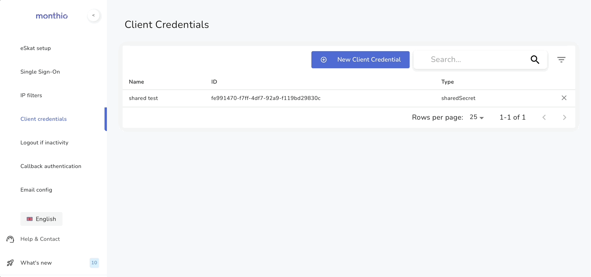
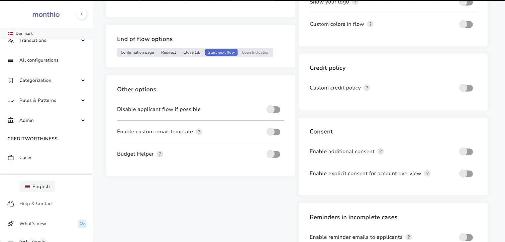

# Monthio Integration Sample

A minimal .NET 10 console app that walks through the full Monthio API flow:
authenticate → create case → ingest eSkat data → wait for applicant → fetch outputs.

## Setup

### 1. Create a client credential

In the Monthio system, log in with **technical admin** privilege and go to **Setup > Client credentials > New client credential**.



This gives you `MONTHIO_CLIENT_ID` and `MONTHIO_CLIENT_SECRET`.

### 2. Enable eSkat ingestion on a configuration

Log in with **admin** privilege and go to **Credit Settings > Configurations**. Enable the eSkat module and turn on **"Post eSkat data with case creation"**.



Note the configuration ID — that is `MONTHIO_CONFIGURATION_ID`.

## Running

### Locally

```sh
MONTHIO_CLIENT_ID=xxx \
MONTHIO_CLIENT_SECRET=xxx \
MONTHIO_CONFIGURATION_ID=xxx \
dotnet run --project MonthioSample
```

### Docker

```sh
docker build -f MonthioSample/Dockerfile -t monthio-sample . \
  && docker run -it \
     -e MONTHIO_CLIENT_ID=xxx \
     -e MONTHIO_CLIENT_SECRET=xxx \
     -e MONTHIO_CONFIGURATION_ID=xxx \
     monthio-sample
```

## Environment variables

| Variable | Required | Description |
|---|---|---|
| `MONTHIO_CLIENT_ID` | Yes | Client credential ID |
| `MONTHIO_CLIENT_SECRET` | Yes | Shared secret for that credential |
| `MONTHIO_CONFIGURATION_ID` | Yes (new case) | Configuration ID from Credit Settings |
| `MONTHIO_INCLUDE_CO_APPLICANT` | No | Set to `true` to add a co-applicant |
| `MONTHIO_CASE_ID` | No | Skip case creation and jump straight to fetching outputs for an existing case |

## Flow

```
1_Authentication.cs   — POST /connect/token (client_credentials) → access token
2_CreateCase.cs       — POST /case → caseId + per-applicant dataIngestionToken + flow URL
3_IngestEskat.cs      — POST /data-ingestion?moduleId=eskat (one call per applicant)
                        Applicant opens their flow URL and completes it
4_GetCaseOutputs.cs   — GET /case/{caseId} → case status and timestamps
5_GetBudgetOutputs.cs — GET budgetOutputs.href → disposableAmount and credit worthiness
```

`Program.cs` is a thin orchestrator that calls into these files in order. All API logic lives in the numbered files.

## Project structure

```
MonthioSample/
  Program.cs               — orchestration only, ~50 lines
  1_Authentication.cs      — OAuth2 token fetch
  2_CreateCase.cs          — create case, request/response models
  3_IngestEskat.cs         — ingest eSkat XML per applicant, print flow URLs
  4_GetCaseOutputs.cs      — fetch case data, print status
  5_GetBudgetOutputs.cs    — fetch and print budget outputs
  eskat-sample.xml         — sample eSkat data for main applicant (test data)
  eskat-sample_co.xml      — sample eSkat data for co-applicant (test data)
  Dockerfile               — multi-stage .NET build
```
